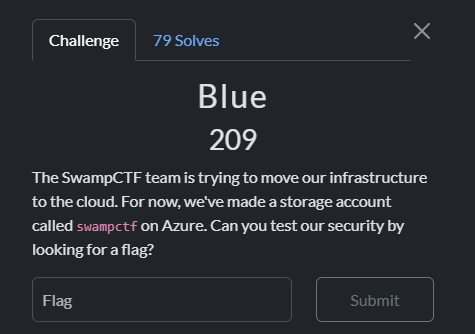
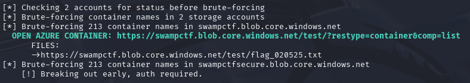
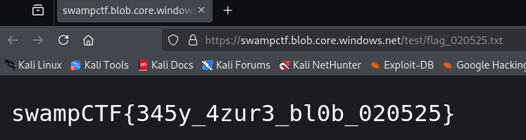

author: @janky
## **Challenge Info:**
##### Category: Misc

## Solution
We probably just need to enumerate the storage account to see what's on there. 

Let's see what tool I can use.

Great! I found something called cloud-enum.

https://www.kali.org/tools/cloud-enum/

Here's the command we'll run: 
`cloud_enum -k swampctf -b /usr/lib/cloud-enum/enum_tools/fuzz.txt -t 10 --disable-aws --disable-gcp`

And once we click on this link we'll see the file contents.

## Flag is: `swampCTF{345y_4zur3_bl0b_020525}`