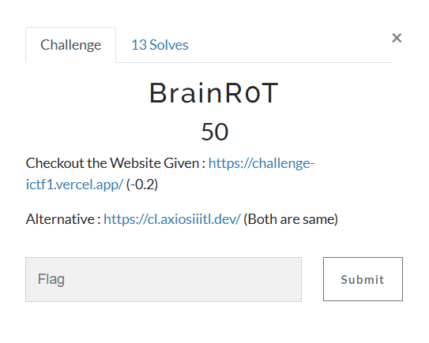
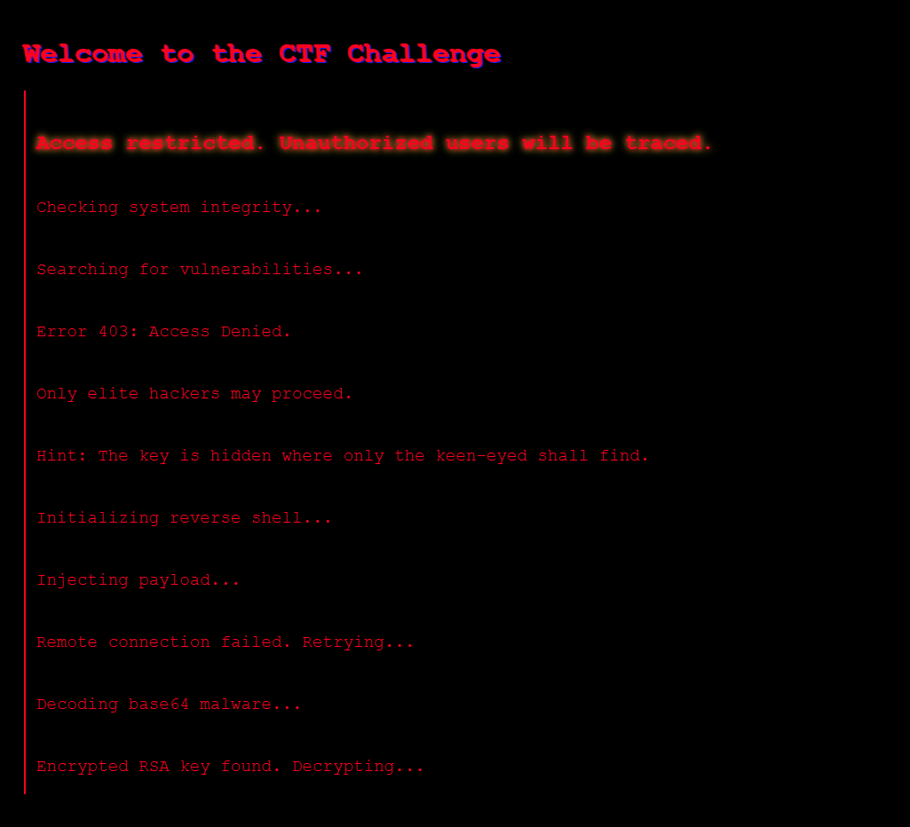
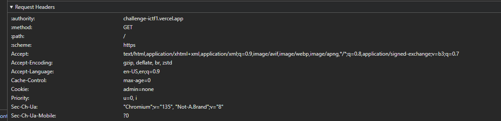
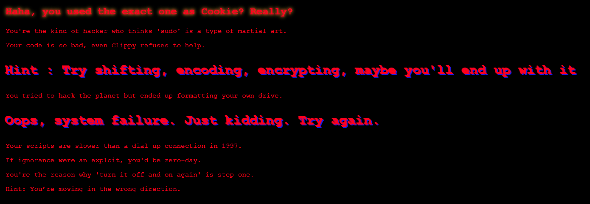
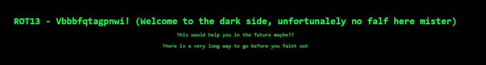
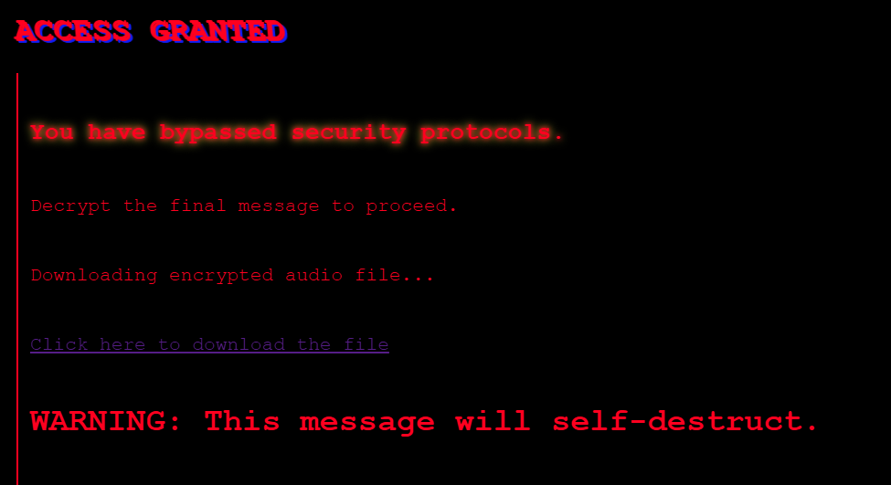
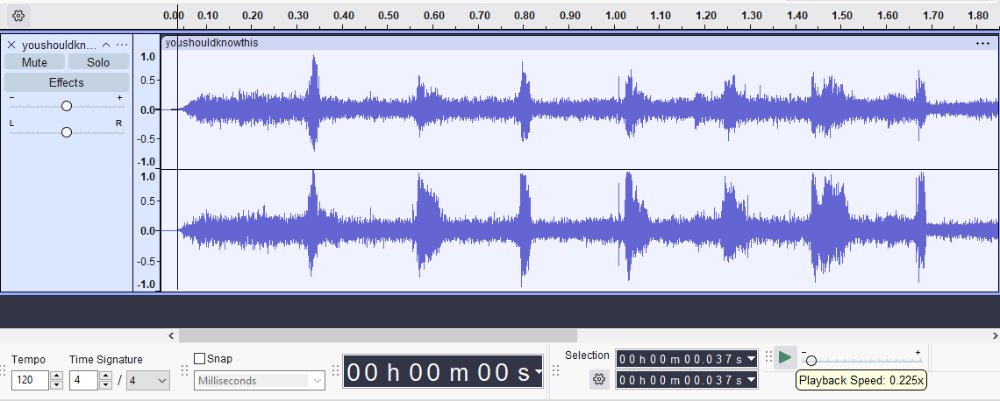
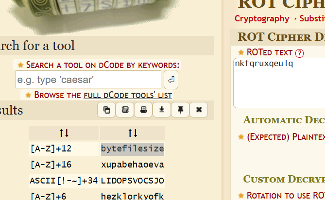
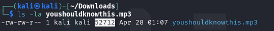
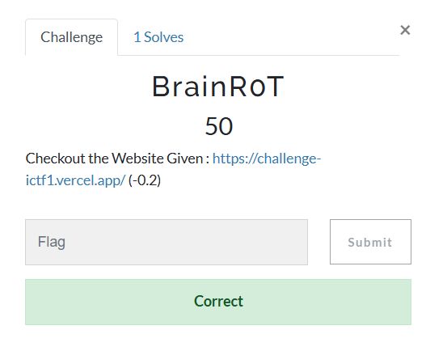

author: @janky
solved with: @yoshixi
## **Challenge Info:**
##### Category: Misc


## Solution

Opening up the site, we first see this:



There's nothing obvious so we'll go ahead and look into the sources.

```html
<!DOCTYPE html>
<html lang="en">
<head>
    <meta charset="UTF-8">
    <meta name="viewport" content="width=device-width, initial-scale=1.0">
    <title>CTF Terminal</title>
    <link rel="stylesheet" href="/static/style.css">
</head>
<body>
    <h1 class="glitch">Welcome to the CTF Challenge</h1>
    <div class="terminal">
        <p class="warning">Access restricted. Unauthorized users will be traced.</p>
        <p>Checking system integrity...</p>
        <p>Searching for vulnerabilities...</p>
        <p>Error 403: Access Denied.</p>
        <p>Only elite hackers may proceed.</p>
        <p>Hint: The key is hidden where only the keen-eyed shall find.</p>
        <p>Initializing reverse shell...</p>
        <p>Injecting payload...</p>
        <p>Remote connection failed. Retrying...</p>
        <p>Decoding base64 malware...</p>
        <p>Encrypted RSA key found. Decrypting...</p>
        <p class="glitch">CRITICAL ERROR: SYSTEM OVERRIDE DETECTED</p>
        <p>Rolling back changes...</p>
        <p class="warning">Unauthorized login attempt detected from [UNKNOWN IP]</p>
        <p>Encrypting all system files...</p>
        <p class="glitch">Kernel panic: fatal system corruption!</p>
        <p class="warning">Hint: Not everything is as it seems...</p>
        <!-- incognitoctf is yummy -->
    </div>
</body>
</html>
```


There an interesting comment here:
```html
<!-- incognitoctf is yummy -->
```

Let's see if it'll help us out in the future...

Alright, so looking at the network requests, we see something interesting in the headers.



```https
Cookie: admin=none
```

Well, it may be a reach but since incognitoctf is yummy -> cookie?

Let's try it out.



We get a really mean message which gives us a hint to use a ROT13 cipher for the cookie, let's try it.

Result:


And here I gave up, but my teammate Yoshixi started checking every ROT of the cookie, i.e. ROT1, ROT2, ROT3, ROT4 ...

Apparently the other ROTs give you a bunch of different pages, but he gave me this:
`fkzldkfqlzqc` (ROT23)

And he found that this gave you this page:



Great! We get a link to a google drive with an audio file.

link: `https://drive.google.com/file/d/1KBKmWwdTnro9WzNw-dm1mVIf14tI5QkD/view?usp=drive_link`

If you download it and listen to it, it sounds sped up. So I pop it into audacity and slow down the speed of it and listen closely. 



It is a guy saying letters with a very bad mic. It took a long time to actually figure out what he was saying but I ended up on: `nksqruxqeulq`

Throwing this into dCode, we get this:



This obviously is suggesting that we use the byte file size as the flag and I totally didn't enter that as it.

So we can just run `ls -l' on the audio file and we get this:



And we were able to get first blood on it.




## Flag is: `ictf{52712}`