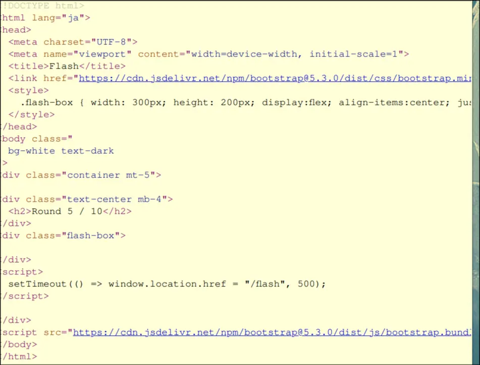
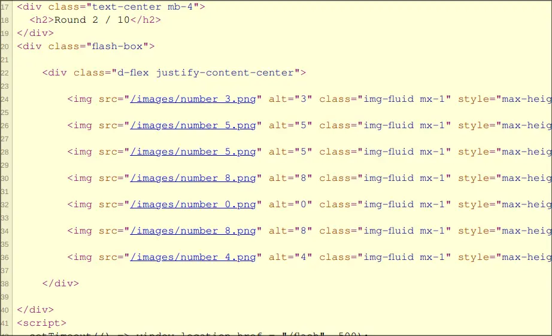
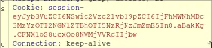

author: @yoshixi
## **Challenge Info:**
##### Category: Web

--- UNINTENDED SOLUTION ---
This challenge consists of a sequence of numbers, of which you need to find the sum of.

However, certain pages do not have a number shown!

(For here, round 2 has numbers, round 5 does not!)
    
    

Though, we notice in web requests, that there is a JWT cookie being sent over

So, at the end, we get the final sum for one of these cookies:

The specific request we have to look into is the GET `/request`, which sends the cookie for the sum that it looks into.

Simply, resend the final sum, and we get the flag

## Flag is: `TsukuCTF25{Tr4d1on4l_P4th_Trav3rs4l}`