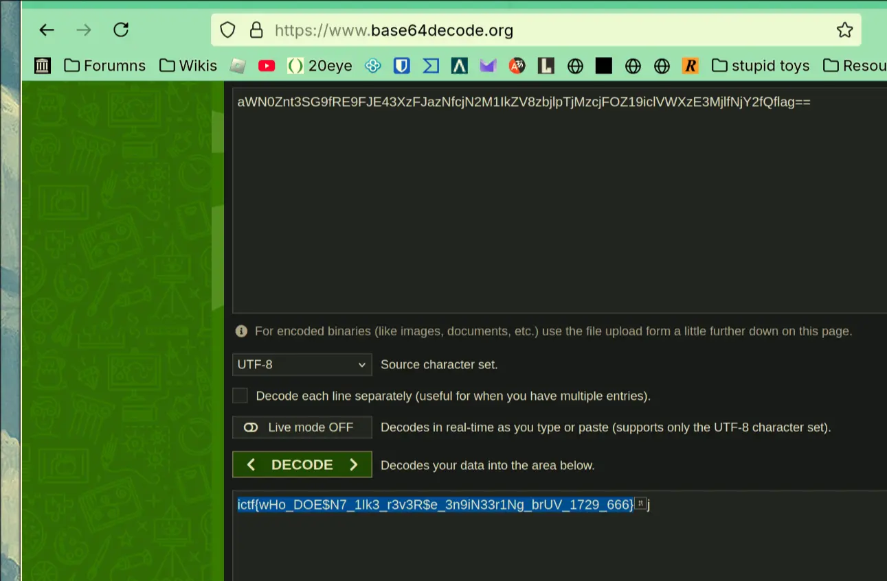

author: @yoshixi
## **Challenge Info:**
##### Category: Binary Exploitation (This is not accurate!)

- 
- 

## Solution

<h2 id="dynamicmayhem">Dynamic Mayhem</h2>

1. This ctf challenge gives a Java file with some encryption and an encrypted file
2. We note that for a dummy flag we provide, the output is 2 times the length
    
3. Checking the file, working from backwards to forwards we find

   `String X1Y2Z3 = X1Y2Z3(P6O5I4(bytes, R7T8Y9(Q4W5E6, M1N2O3)));`
4. The function X1Y2Z3 returns the hex version of each byte in the return of P60514(....), 
5. The function P60514 performs operations to original byte array
6. bytes are just the byte representation of the flag
7. R7T8Y9 performs some operations to a given byte array with a integer
8. Q4W5E6 is a constant byte array that undergoes operations with MIN203
9. MIN203 is a randomly generated integer
# Reversing process:
1. We brute force MIN2O3, and then compute Q4W5E6 and R7T8Y9
2. We undo the X1Y27B function to get P60514
3. We compute the bytes from P60514 and R7T8Y9 and then convert bytes to flag
# Final Script

```java
import java.io.IOException;
import java.nio.charset.StandardCharsets;
import java.nio.file.Files;
import java.nio.file.OpenOption;
import java.nio.file.Paths;
import java.security.SecureRandom;
import java.util.Random;

public class Main {
  public static void main(String[] args) {
    // randomly generate M 
    for (int M1N2O3 = 0; M1N2O3 < 65536; M1N2O3++){
    //int M1N2O3 = 6528;
    byte[] Q4W5E6 = Q4W5E6(M1N2O3);
    //System.out.println("Q4W5E6:");
    //printbytes(Q4W5E6);
    byte[] R7T8Y9 = R7T8Y9(Q4W5E6, M1N2O3);
    //System.out.println("R7T8Y9:");
    //printbytes(R7T8Y9);
    byte[] P605I4 = reverseX1Y2Z3("A1C796EFF027D1887DD59E40ED7BB7F646C0AAE60E523BCBD89012CCAF3741B2B6CC15CB4389786E04A6D3CAB29D44D98ED53446F66B67E45CAC0D8BC35B10DC5553145303887D2861EA51039907D86500000A147D64F20CFA5B27D55DEE03D93C3CC4640EA46DEBA4FF1D810526C7FDF3588B64C556B93610C540426936A627530D90E9594961E1F5DE4DCECAD5B2B2F2ADCD513B483EBFC4728E1AAF1D37173E26500000A187765F682B172B7D957EF07577715546804A56965EFD68D8D0F27C373B8711B68CF57BDB85BECD04E6337A2A9182D9CE3584DEFAADC4E41C4CBD13CF9DB3DC15B3A4CB0F4EDE28210AE19B95C17B65");
    //System.out.println("P605I4:");
    //printbytes(P605I4);
    byte[] bytes = reverseP6O5I4(P605I4, R7T8Y9);
    //System.out.println("bytes:");
    //printbytes(bytes);
    String originalString = new String(bytes, StandardCharsets.UTF_8);
    System.out.println(originalString);
    }
  }

  public static void printbytes(byte[] bArr){
    for (int i = 0; i < bArr.length; i++){
      System.out.print(Byte.valueOf(bArr[i])+ ",");
    }
    System.out.println("");
  }

  public static byte[] reverseP6O5I4(byte[] encryptedOutput, byte[] bArr2) {
    byte[] bArr = new byte[encryptedOutput.length];
    for (int i = 0; i < encryptedOutput.length;i++){
      bArr[i] = (byte) ((encryptedOutput[i] ^ (i * 13)) ^ (-1));
    }
    // second pass
    for (int i = 0; i < encryptedOutput.length;i++){
      bArr[i] = (byte) (bArr[i] ^ bArr2[i % bArr2.length]);
    }
    
    return bArr;
  }


public static byte[] reverseX1Y2Z3(String hex) {
    int len = hex.length();
    if (len % 2 != 0) {
        throw new IllegalArgumentException("Hex string must have an even length");
    }
    byte[] result = new byte[len / 2];
    for (int i = 0; i < len; i += 2) {
        String byteStr = hex.substring(i, i + 2);
        result[i / 2] = (byte) Integer.parseInt(byteStr, 16);
    }
    return result;
}


  public static byte[] Q4W5E6(int i) {
    byte[] bArr = new byte[47];
    bArr[0] = 63;
    bArr[1] = -94;
    bArr[2] = 29;
    bArr[3] = 87;
    bArr[4] = -119;
    bArr[5] = -61;
    bArr[6] = 78;
    bArr[7] = 114;
    bArr[8] = -71;
    bArr[9] = -40;
    bArr[10] = -6;
    bArr[11] = 6;
    bArr[12] = 52;
    bArr[13] = 92;
    bArr[14] = -99;
    bArr[15] = -31;
    bArr[16] = 35;
    bArr[17] = 103;
    bArr[18] = -85;
    bArr[19] = -115;
    bArr[20] = 69;
    bArr[21] = -14;
    bArr[22] = -58;
    bArr[23] = 56;
    bArr[24] = 126;
    bArr[25] = -112;
    bArr[26] = -47;
    bArr[27] = 90;
    bArr[28] = -73;
    bArr[29] = -17;
    bArr[30] = 44;
    bArr[31] = -127;
    bArr[32] = -92;
    bArr[33] = 111;
    bArr[34] = 57;
    bArr[35] = -56;
    bArr[36] = -38;
    bArr[37] = -11;
    bArr[38] = 11;
    bArr[39] = 125;
    bArr[40] = -111;
    bArr[41] = -26;
    bArr[42] = 66;
    bArr[43] = 58;
    bArr[44] = -51;
    bArr[45] = 117;
    bArr[46] = -6;
    for (int i2 = 0; i2 < bArr.length; i2++) {
        int i3 = i2;
        bArr[i3] = (byte) (bArr[i3] ^ ((byte) (i >> (i2 % 8))));
    }
    return bArr;
  }
    public static byte[] R7T8Y9(byte[] bArr, int i) {
        byte[] bArr2 = new byte[bArr.length];
        for (int i2 = 0; i2 < bArr.length; i2++) {
            bArr2[i2] = (byte) (bArr[i2] ^ (i & 255));
        }
        return bArr2;
    }


}
```
# Finding the flag
`javac Main.java && java Main >> results.txt`

I ended up searching for a while because I expected the flag to be wrapped in `{}`, but it turns out it was base64 encoded.




## Flag is: `ictf{wHo_DOE$N7_1Ik3_r3v3R$e_3n9iN33r1Ng_brUV_1729_666}`